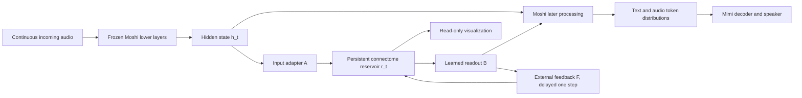

> Archived proposal. Self-improvement and extra feedback learning were abandoned. See [the implemented fixed reservoir/readout](moshi-reservoir.md) for the current system.

# Eric: from a duplex visualizer to a connectome reservoir with feedback

## Goal

Keep a natural, full-duplex spoken conversation while making a connectome-derived recurrent circuit a measurable part of the computation. Visualize the same reservoir state that affects the response. Treat learned functions as engineering results, not evidence that flies understand human language.

## Milestone 0 — the current implementation

- Moshi MLX 0.3.0, `kyutai/moshiko-mlx-q4`, pinned revision `18e4df760a34d5977a34517d7d1580e07acbb2f1`.
- Continuous 24 kHz microphone and speaker streams in 80 ms frames. No Whisper/Ollama/Qwen-TTS cascade, turn-based microphone gate, or output transcription/retry.
- A serialized model worker and a separate serialized Mimi codec worker overlap inference and audio processing. Queues are bounded; a slow machine produces an explicit error instead of silently accumulating old speech.
- Each call starts with fresh Moshi state and a newly constructed Mimi codec with expanded positional capacity (`max_seq_len=16384`). The baseline limits a call to five minutes, then asks the user to start another call.
- Each model step exposes its normalized temporal-transformer state. A fixed signed block projection reduces its 4,096 dimensions to 64 bounded feature channels.
- The full FLM-retained MaleCNS graph (166,700 neurons / 25,582,938 directed edges) runs the unsigned incoming-normalized FLM recurrence on a separate server CPU worker. The input is a seeded projection of 64 Moshi features, aligned with browser playback, requested at up to 5 Hz. All edges participate.
- The 3D viewer displays the 139,662 recorded soma positions and signed abstract states. The remaining neurons are computed but not positioned. These are not spikes, dopamine, or established speech pathways. This display has no effect on model output. See [full-connectome.md](full-connectome.md) for exact equations and provenance.
- Existing cloned-voice code and local reference audio are preserved as a separate fallback.

**Causal direction today:** conversation/model → circuit → display. No reservoir feedback into Moshi. No online learning. No custom Eric persona or cloned voice is claimed for stock Moshi.

## Proposed architecture



There are two separate feedback concepts:

1. **Reservoir readout → Moshi:** gives the reservoir a causal role in speech generation.
2. **Reservoir readout → reservoir:** changes its future activity and supplies the feedback-learning mechanism.

Neither path is a measured connectome edge. Preserve the anatomical graph and label these additional learned connections separately.

### A concrete starting formulation

At model step t (80 ms), obtain `h_t` at a selected temporal-transformer layer. The previous reservoir state persists across steps. For a rate-based prototype:

```
u_t = A(normalize(h_t))
r_t = (1-alpha)*r_(t-1) + alpha*phi(J*r_(t-1) + u_t + F*z_(t-1) + bias)
z_t = B*r_t
h'_t = h_t + gate*clip(z_t)
```

- `J`: sparse effective weights derived from the selected connectome. Fix topology, retain source data and provenance, and explicitly document gain, transmitter-sign assumptions, omitted neurons, and normalization.
- `A`: input adapter (initially fixed; train later if useful).
- `B`: trained readout, with an optional low-rank expansion back to Moshi's hidden dimension.
- `F`: external feedback projection; start fixed and small before experimenting with learning it.
- `alpha`, activation, integration timestep and clipping are model parameters, not measured properties of every fly neuron.
- Initialize the readout contribution near zero and increase it only after training. A zero gate preserves Moshi's original path but does not prove the reservoir will learn anything useful.
- Use previous-step feedback to avoid a circular same-step dependency. Timestamp all state updates.

This feedback formulation is a proposal. Today's fixed FLM recurrence is `x_next = tanh(W @ (0.6*x + 0.4*input))`, with unsigned normalized anatomical contacts. Any changes to this baseline must be versioned and evaluated; transmitter signs or biological timing must not be inferred from it.

## Milestone 1 — establish a reproducible duplex baseline

1. Measure streaming throughput and growing latency over full calls, including simultaneous microphone and output audio, interruptions, long silences, and repeated reconnects.
2. Keep the model fixed. Record audio/features only in explicit offline experiments; live conversations should not be saved by default.
3. Save seeds, model revision, runtime versions, audio input, model-step timing, and feature tap location for each experiment.
4. Compare model output with visualization enabled/disabled under the same input and seed. The output must be identical because the display is read-only; also compare throughput.
5. Check memory and frame latency near the five-minute boundary. A 7B model can fit yet still fail to sustain 12.5 steps/second on a particular machine.

**Exit:** reproducible audio and telemetry; no silent backlog; state resets between calls; a documented performance envelope. Passing transport tests alone does not establish conversational quality or reliable interruption behavior.

## Milestone 2 — move the authoritative reservoir beside inference

The browser must not own state that will later affect speech: hidden tabs, dropped frames, or slower rendering cannot change the model's behavior.

1. The full graph update already runs server-side. Move its input source from browser playback telemetry directly into the model inference loop; retain exact IDs, graph hashes, parameters and ordering.
2. Establish parity on prerecorded drives against the current simulation, or explicitly version a different rate-based circuit. Unit-test input, reset and recurrent-state behavior.
3. Update the circuit at a defined integration rate between Moshi frames. Stream compact abstract-state snapshots to the existing visualizer.
4. The browser may pause drawing without pausing model/reservoir computation. Keep manual stimulation as an explicitly separate experiment mode.
5. Reject non-finite state, cap injected currents, and log numerical instability in offline experiments.

**Exit:** one authoritative reservoir, with reproducible state; visualization is only a subscriber.

## Milestone 3 — learn a readout and feedback on a bounded task

Start with a small continuous target, such as an annotated probability of yielding a conversational turn. Do not start by generating raw waveforms or teaching the reservoir all language.

### FORCE-style experiment

- Fix `J`, input projection and an initial feedback projection.
- Train a linear readout using an error against a known target, using recursive least squares or an appropriate stabilized variant.
- Feed the readout's output back into the reservoir during training. Adjusting readout weights changes the feedback signal and thereby future reservoir trajectories.
- Test held-out trajectories with the learned readout frozen, in the closed loop, without feeding ground-truth targets back.
- Measure target error, state norms, recovery after silence, perturbation sensitivity and stability over longer sessions.

FORCE learning is a precedent for controlling recurrent dynamics, not a proven plug-in solution for Moshi, this connectome, spiking dynamics, or open-ended speech. The initial readout can remain diagnostic until its behavior is understood. At this stage it does not yet improve conversation unless it is connected to generation in the next milestone.

**Exit:** the reservoir learns and reproduces a specified signal on held-out data, with stable feedback. Activity alone is not a learning objective.

## Milestone 4 — integrate a trained residual into Moshi

1. Select and instrument a temporal-transformer layer **before** the downstream prediction being modified. The current final-state telemetry tap is not automatically the right insertion point.
2. Keep Moshi's weights frozen initially. Train the readout/output adapter and, if needed, the input adapter using paired multi-speaker conversational audio and aligned token targets.
3. Specify the task and loss: audio/text token prediction on a targeted conversational dataset, optionally a supervised turn-taking objective, plus a penalty limiting harmful deviation from the baseline. Copying baseline outputs alone can favor a zero residual; include a task that rewards using reservoir state.
4. If gradients must pass through time, train through the recurrent trajectory using truncated backpropagation and an appropriate differentiable neuron model. Freezing `J` does not remove the need to propagate gradients through state transitions when training `A` or `F`.
5. Validate using free-running rollouts. Teacher-forced loss alone misses feedback instability and compounded errors.
6. Measure the extra per-frame cost. The whole audio pipeline must still sustain real time.
7. Only if necessary, add small Moshi LoRA adapters. Official Moshi fine-tuning is a useful starting point, but does not implement this reservoir architecture. Plan training on a suitable GPU; do not assume the Mac inference setup can also train it efficiently.

**Exit:** reproducible, useful changes to speech behavior without unacceptable latency, audio degradation, or unstable feedback.

## Milestone 5 — prove that the circuit contributes

Evaluate the same held-out conversations and multiple seeds with:

- Baseline Moshi.
- Reservoir attached but readout gate at zero.
- Reservoir state reset every frame (removes temporal memory).
- Zeroed or shuffled reservoir features.
- Feedback disabled.
- A random reservoir with a matched size and suitable connectivity/weight statistics.
- A parameter-matched nonrecurrent adapter.

Measure conversational task success, response timing, interruption recovery, overlapping speech, intelligibility, human preferences, memory use and frame latency. Changed output establishes an effect; improved measured behavior establishes usefulness. A random reservoir performing equally well would argue against a special benefit from fly wiring.

## Milestone 6 — optional learning during calls

Only after offline success, consider constrained updates to a small readout/feedback adapter using explicit feedback or a validated objective. Separate inference state from learned parameters; checkpoint updates, allow rollback, and evaluate held-out behavior. Do not adapt the entire model from its own unverified output or treat higher firing rates as a reward. Online learning is not enabled in the current app.

## Visualization contract

- Label the current mode: one-way display, trained open-loop reservoir, or trained closed-loop reservoir.
- Show simulated rates and external stimulation separately; identify learned feedback as an additional input.
- Preserve neuron IDs, roles, transmitter annotations and data attribution.
- Never label cells as English comprehension, thinking, happiness, dopamine release, or speech production without relevant evidence.
- In the trained version, display actual server reservoir snapshots, not a separate decorative replay.
- Show model time and rendering time separately when buffers or downsampling introduce delay.

## Sources and starting points

- [Moshi model and inference](https://github.com/kyutai-labs/moshi)
- [Moshi MLX](https://github.com/kyutai-labs/moshi/tree/main/moshi_mlx)
- [Moshi fine-tuning](https://github.com/kyutai-labs/moshi-finetune)
- [Sussillo & Abbott (2009), FORCE learning](https://doi.org/10.1016/j.neuron.2009.07.018)
- [MaleCNS motor-circuit provenance](../dist/neural/LOCOMOTOR_PROVENANCE.md)
- [Vendored code/data attribution](../dist/neural/ATTRIBUTION.md)
